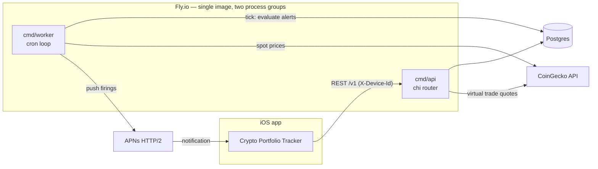

# Crypto Portfolio Tracker — API


Backend for the [Crypto Portfolio Tracker iOS app](https://github.com/efekckk/crypto-portfolio-tracker).
Two responsibilities:

1. **Price alerts** — evaluates user-defined alert conditions on a cron tick
   against live CoinGecko prices and delivers firings as APNs push notifications.
2. **Virtual portfolios** — paper-trading portfolios with quoted trades,
   position tracking, and P/L computed server-side.

## Architecture



- `internal/api` — HTTP handlers, device-ID auth middleware, per-device trade rate limiting
- `internal/eval` — alert condition evaluation (price threshold, percent move, portfolio value/P&L) + recurrence rules (one-shot, cooldown, on-each-crossing)
- `internal/virtual` — virtual portfolio position/P&L computation and pricing
- `internal/worker` — the cron-side orchestrator: one `Tick` = evaluate → push → record delivery state
- `internal/push` — APNs HTTP/2 client
- `internal/storage` — Postgres repositories + migrations

## API surface

All `/v1` routes except device registration require an `X-Device-Id` header
obtained from `POST /v1/devices`.

| Method | Path | What it does |
|---|---|---|
| `GET` | `/health` | Liveness check |
| `POST` | `/v1/devices` | Register a device (returns device ID) |
| `GET/PUT/DELETE` | `/v1/alerts`, `/v1/alerts/{id}` | Manage price alerts |
| `GET/PUT/DELETE` | `/v1/holdings`, `/v1/holdings/{coin_id}` | Sync portfolio holdings |
| `POST/GET` | `/v1/virtual/portfolios` | Create / list virtual portfolios |
| `GET/DELETE` | `/v1/virtual/portfolios/{id}` | Detail (positions + P/L) / delete |
| `GET` | `/v1/virtual/portfolios/{id}/quote` | Live trade quote |
| `POST` | `/v1/virtual/portfolios/{id}/trades` | Execute a trade (rate-limited per device) |
| `GET` | `/v1/virtual/portfolios/{id}/trades` | Trade history |

## Run locally

```bash
go mod tidy
go test ./...
PORT=8080 go run ./cmd/api
```

Health check: `curl localhost:8080/health` → `{"status":"ok"}`

## Deploy (Fly.io)

```bash
# 1. one-time bootstrap
flyctl auth login
flyctl launch --copy-config --name cryptoportfolio-alerts --region fra

# 2. attach Postgres
flyctl postgres create --name cryptoportfolio-db --region fra
flyctl postgres attach cryptoportfolio-db --app cryptoportfolio-alerts

# 3. APNs secrets (replace with your values)
flyctl secrets set \
  APNS_KEY_ID=ABCDE12345 \
  APNS_TEAM_ID=1A2B3C4D5E \
  APNS_BUNDLE_ID=com.foneria.cryptoportfolio \
  --app cryptoportfolio-alerts
flyctl secrets set APNS_AUTH_KEY="$(cat AuthKey_ABCDE12345.p8)" --app cryptoportfolio-alerts

# 4. CoinGecko Demo key (optional)
flyctl secrets set COINGECKO_API_KEY=your-demo-key --app cryptoportfolio-alerts

# 5. deploy both processes (api + worker)
flyctl deploy --app cryptoportfolio-alerts

# 6. tail logs
flyctl logs --app cryptoportfolio-alerts
```

The Dockerfile builds both `cmd/api` and `cmd/worker` into a single image;
`fly.toml` runs them as separate process groups.

## Testing

Handler, evaluator, and virtual-portfolio logic are covered by unit tests, plus
an end-to-end virtual-portfolio journey test:

```bash
go test ./...
```
